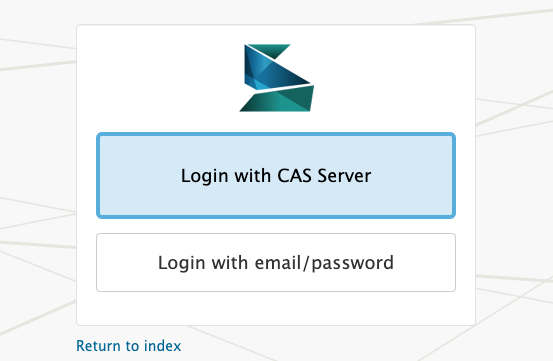
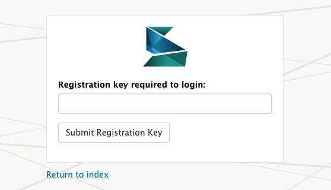

# Scalar CAS Authentication 

A plugin for [anvc/scalar](https://github.com/anvc/scalar). 

This plugin allows users to authenticate using CAS in addition to the existing email/password authentication. If registration keys are configured in `local_settings.php`, the user will be prompted the first time they attempt to login with CAS.






## Requirements

1. Scalar must be installed and configured.
1. Scalar must be registered with the CAS server.
2. The CAS server must supply the following attributes:
    - `eduPersonPrincipalName`: uniquely identifies the user
    - `mail`: email address required to register a Scalar account (or link to pre-existing account)
    - `displayName`: full name required to register a Scalar account

## Quickstart

1. Download and unzip to `system/application/plugins/casauth`. 
2. Rename `config.ini.sample` to `config.ini` and update the CAS settings to point to your CAS server.
3. Create database table(s) for this plugin by running the SQL in `plugin.sql` against your Scalar database.
4. Activate the plugin in `system/application/config/plugins.php`:
    ```
    $config['plugins']['auth'] = 'casauth';
    ```
5. Visit http://localhost:8080/system/login

## Tests

- PHP 7.1 requires PHPUnit 7.x
- PHP 7.2+ requires PHPUnit 8.x or higher

To install PHPUnit 7.x via PHP Archive (PHAR):

```
$ wget -O phpunit https://phar.phpunit.de/phpunit-7.phar
$ chmod u+x phpunit
$ ./phpunit --version
PHPUnit 7.5.16 by Sebastian Bergmann and contributors.
```

To run unit tests:

```
$ ./phpunit --bootstrap autoload.php tests
```

